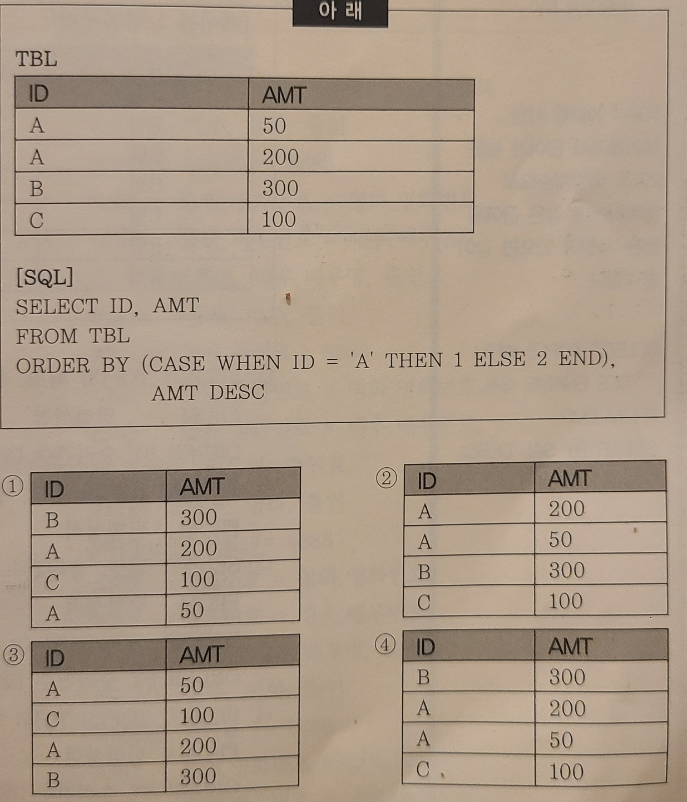

 

- ### CASE문 질문
```
CASE문에 ID가 'A'인 데이터는 1 아니면 2로 출력 인데 왜 ID가 1 or 2로 출력이 안되고 A,A,B,C로 출력 된건가요? 
(ORDER BY절에 CASE문을 써서 그런건가요?)
```
 
 ```sql
  ORDER BY (CASE WHEN ID = 'A' TEHN 1 ELSE 2 END), AMT DESC
  위 SQL문은 ID가 A면 1 틀리면 2 나타냄.
  즉, A면 1번째 컬럼 ID를 오름차순 정렬, A가 아니면 2번째 컬럼 AMT를 오름차순 정렬하는데
  콤마 찍고 AMT DESC가 있기에 AMT는 최종 내림차순으로 정렬 됨

  -- ex) ename 컬럼 오름차순 정렬
  SELECT
    ename,
    sal
  FROM emp
  ORDER BY 1 
 ```


- ### ORDER BY, GROUP BY 질문
 ```
 2번은 왜 맞고 3번은 왜 오류가 발생하는지 궁금합니다.

 ```

```sql
 모두 정답입니다.
 음.. 출제자 의도를 잘모르겠어요!
 우선, group by했으면 grouping한 컬럼은 정렬이 가능하지만 
 select에 없는 년 컬럼은 논리적으로 불가능하다. 요정도로 알고 있죠!! 탕탕탕 
```