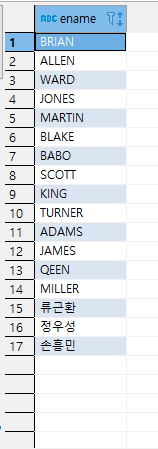
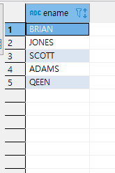

## CASE문(개념정리 다시다시!!!!!!!!!!!!!!!!!!!!!!!!!!!!!!)

```
CASE문 문법)
== CASE WHEN '조건' THEN '출력 값' (ELSE '값' END)
== CASE '컬럼명' WHEN '조건' THEN '출력 값'
예제)
CASE '컬럼명'
WHEN 조건1 THEN 값1
WHEN 조건2 THEN 값2
WHEN 조건3 THEN 값3
.
.
ELSE 값4
END
='컬럼명'에서 조건1일때는 값1을 출력, 조건2일때는 값2 출력..., 조건이 다 아니라면 값4를 출력
```

## ISNULL / IFNULL / NVL / NVL2

```
- ISNULL('컬럼명','지정값')
- IFNULL('컬럼명','지정값')
- NVL('컬럼명','지정값')
    ='컬럼명'이 NULL일 경우 지정값으로 출력해줘

- NVL2('컬럼명','지정값1','지정값2')
    ='컬럼명'이 NOT NULL인 경우(NULL이 아닌 경우)지정값1을  출력하고, NULL인 경우 지정값2를 출력한다.
    ex)NVL2(comm, 'y', 'n')
    =comm이 NOT NULL인 경우 y출력 / NULL인 경우 n 출력
```

## NULLIF

```
1. NULLIF (표현식1, 표현식2) : 표현식1 과 2가 같으면 NULL, 다르면 표현식 1 리턴
ex)
SELECT ENAME, EMPNO, MGR, NULLIF(MGR, 7698) NUIF
FORM   EMP ;

    = MGR 7698 이면 NULL로 표시한다.
```

## NULL 포함 연산의 결과

```
- NULL 과 연산을 하게되면 결과는 무조건 NULL값이 나옴
ex)NULL+2=NULL , NULL*2=NULL , NULL/2=NULL
```

## COALESCE()문

```
=NULL이 아닌 최초의 표현식 값을 반환
ex)
컬럼명          데이터
SAL          NULL,200,NULL,300
COMM        NULL,NULL,50,20

SELECT COALESCE(SAL,COMM)
결과-> 200 50
```

## TOP / TOP WITH TIES

```
- SELECT TOP3
    =출력값의 3번째까지 짜름 , LIMIT 3과 같은의미
    =ORDER BY절 없어도됨

- SELECT TOP3 WITH TIES '컬럼명1','컬럼명2'
    ~~
    ~~
    ~~
  ORDER BY '컬럼명1'
    ='컬럼명1'에 동일한 데이터가 있을경우 '컬럼명1','컬럼명2' 함께 출력
    =ORDER BY절과 반드시 함께 와야함
```

## 카티시안 곱(=Cartesian Product)=(CROSS JOIN)

```sql
*정상 JOIN문법
select e.ename, d.dname
from emp e, dept d
where e.deptno = d.deptno
=
select e.ename,d.dname
from emp e inner join dept d
on e.deptno = d.deptno

*비정상 JOIN문법
제대로된 JOIN문법이 나오지 않았을 경우 테이블끼리 곱한다.
(테이블1\*테이블2)
(아래와 같은 문법일 경우 카티시안 곱 실행)
select e.deptno, d.LOC
from emp e, dept d
```


## FROM절의 DUAL(가상테이블)

```sql
기존에 emp테이블과 dept테이블 두가지 테이블만 있어도
dual을 이용하면 CREATE / INSERT INTO 를 사용하지 않아도
가상으로 테이블을 만들 수 있다.

select 7788 empno,
	'류근환' ename,
	'manager' job
from dual
```

## \*\*\*EXISTS / NOT EXISTS

```sql

1. exists->dept테이블에 데이터가 있는지 없는지 확인 있으면 e.ename 전체 출력
    not exists-> dept테이블에 데이터가 있기때문에 출력되지 않음

SELECT e.ename
FROM emp as e
WHERE exists(
    SELECT *
    FROM dept as d
)
```

 

```sql
2. exists-> dept테이블 dname에 'RESEARCH' 가 있으면 e.ename 전체 출력
    not exists-> dept테이블에 데이터가 있기때문에 출력되지 않음

SELECT e.ename
FROM emp as e
WHERE exists(
    SELECT *
    FROM dept as d
    WHERE
    d.dname = 'RESEARCH'
    )
```

 

```sql
3. *exists-> 서브쿼리 WHERE절에 e.deptno = d.deptno 라는 join 조건이 온다면
    emp테이블에 있는 사원들 중 dname이 'RESEARCH'인 사원의 ename만 출력


    *not exists-> emp테이블에 있는 사원들 중 dname이 'RESEARCH'가 ***아닌 사원의 ename만 출력 not exists이기 떄문에

SELECT e.ename
FROM emp as e
WHERE exists(
    SELECT *
    FROM dept as d
    WHERE e.deptno = d.deptno
    and
    d.dname = 'RESEARCH'
    )
```

- ## exists



- ## not exists


### 포인트

```
1. 서브쿼리의 SELECT는 중요하지 않음!
2. 2번까지는 우리가 알고 있었던 서브쿼리의 true,false에 따라 메인쿼리 실행여부 맞음
3. 3번은 메인쿼리에 emp테이블이 있기때문에 서브쿼리의 JOIN조건은 메인쿼리에도 영향을 줌(***서브쿼리 WHERE절에 참조키가 중요하다!!!)
```

### NOT IN 과 NOT EXISTS 차이점

```
NOT IN-> NULL을 빼고 출력
NOT EXISTS-> NULL을 포함해서 출력
```
