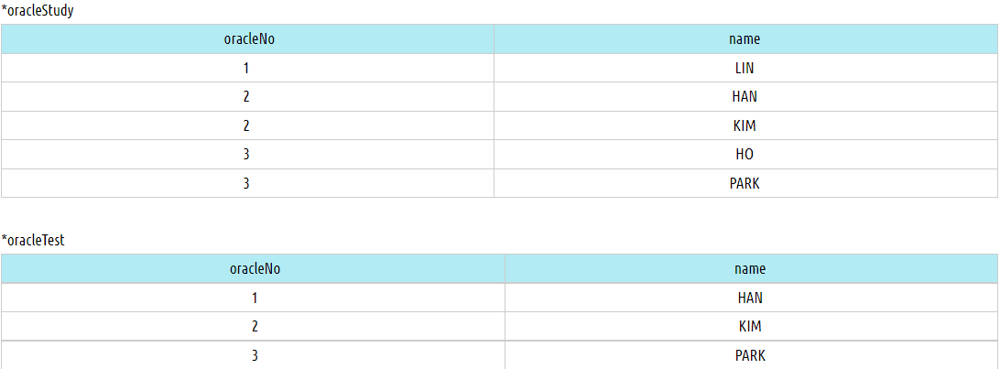
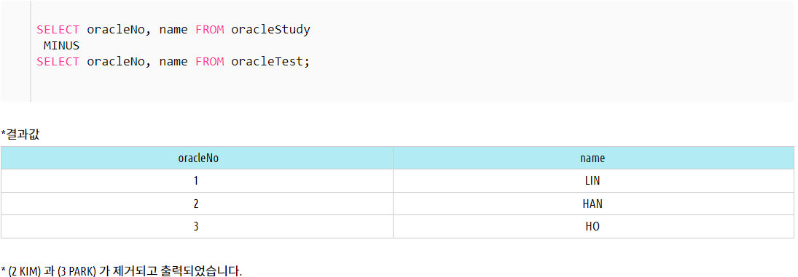

- ## UNION(쿼리문 합치는 방법)

```sql
            테이블1                   테이블2
        ID       NAME            ID         NAME
        1       김서방            2         조서방
        2       조서방            3         박서방

 SELECT ID,NAME
 FROM 테이블1 ;

 **UNION ALL(각 쿼리에서 나온 데이터를 하나로 합쳐주는 역할을 하고 있으며, ***중복을 포함한 결과의 합을 검색)
 (* UNION ALL 을 제외한 모든 집합연산자는 중복을 제거하여 출력됩니다.)


 SELECT ID, NAME FROM 테이블2 ;

결과 ->
        ID      NAME
        1       김서방
        2       조서방
        2       조서방
        3       박서방

 SELECT ID, NAME FROM TABLE1 ;

 **UNION(각 쿼리에서 나온 데이터를 하나로 합쳐주는 역할을 하고 있으며, ***중복을 제거한 결과의 합을 검색)

 SELECT ID, NAME FROM TABLE2 ;

결과 ->
        ID      NAME
        1       김서방
        2       조서방
        3       박서방
```

- ## EXCEPT(차집합)

```sql
1. EXCEPT 연산을 사용하면 SQL을 실행한 결과의 차집합을 구할 수 있다.
2. 첫번째 테이블에는 있고 두번째 테이블에는 없는 데이터만을 구하는 차 집합을 구하는것
3. SELECT * FROM A LEFT JOIN B WHERE B IS NULL과 같다.

ex)
(SELECT course_id FROM section WHERE sem='Fall' AND year=2019)
*EXCEPT
(SELECT course_id FROM section WHERE sem='Spring' AND year=2020)

=위 SQL은 2019 가을 학기에 열린 과목 중 2020 봄 학기에 열리지 않은 과목의 course_id를 가져오는 SQL이다.
```

- ## INTERSECT(교집합)

```sql
1. INTERSECT 연산을 사용하면 SQL을 실행한 결과의 교집합을 구할 수 있다.
2. 두개의 테이블에 데이터가 동시에 존재하는 교집합을 구하는 것

ex)
(SELECT course_id FROM section WHERE sem='Fall' AND year=2019)
*INTERSECT
(SELECT course_id FROM section WHERE sem='Spring' AND year=2020)

=마찬가지로 위 SQL은 2019 가을 학기와 2020 봄 학기에 모두 열린 과목의 course_id를 가져오는 SQL이다.
```

- ## MINUS(차집합)

```sql
1. 한 데이터 집합(첫번째 SELECT문)을 기준으로 다른 데이터 집합(두번째 SELECT문)과 공통된 항목을 제외한 결과만 추출
2. 첫번째 SELECT문에서 두번째 SELECT문을 제외한 차집합
ex)
SELECT '컬럼명' FROM 테이블1

 MINUS

SELECT '컬럼명' FROM 테이블2;

```





- ## <a href ="https://coding-factory.tistory.com/461">계층형 쿼리</a> START WITH / CONNECT BY / PRIOR (오라클에만 있는 함수)

```sql
문법)
SELECT [컬럼]...
FROM [테이블]
WHERE [조건]
START WITH [최상위 조건]
CONNECT BY PRIOR [부모(상위노드)]=[자식(하위노드)]
```

```
<아래 사진 설명>
DEP_CD = 부서코드
PARENT_CD = 상위부서코드
DEPT_NAME = 부서이름
```


- ### 연산자<> = != 같은의미
